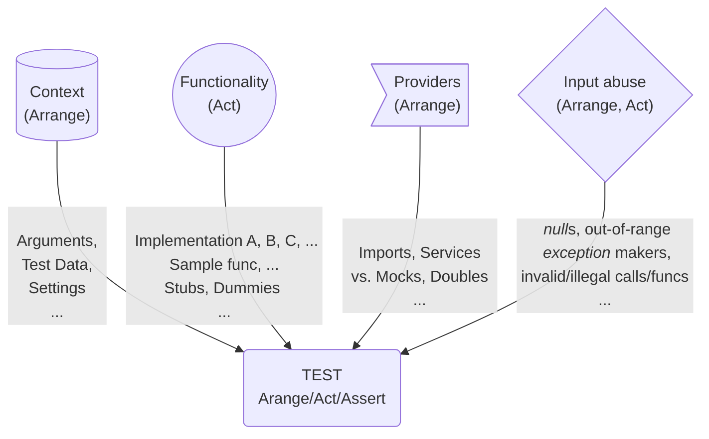

# Programmatic Tests &mdash; DAMP not DRY

<table><tr><td>
Either <a href="../../asDrive">TDD</a> or proof of the provided code, <b>a conventional approach</b> is to

    <ul>
        <li>pick a software <b>entity</b> (class, function, or something else),</li>
        <li>consider a significant <b>use case</b> of it,</li>
        <li>and write a <b>test method</b> over this.</li>
    </ul>
</td><td>

↗️&nbsp;<b>A<samp>RRANGE</samp></b>&nbsp;➡️  ➡️&nbsp;&nbsp;&nbsp;&nbsp;&nbsp;<b>A<samp>CT</samp></b>&nbsp;&nbsp;&nbsp;&nbsp;&nbsp;➡️  ➡️&nbsp;&nbsp;<b>A<samp>SSERT&nbsp;&nbsp;↩️</samp></b>

</td></tr></table>

After polishing the logic and wording, consider and write other test cases. 

Developing tests this way shall (<ins>not guaranteed</ins>) wrap features in pleasant _<b>D</b>escriptive <b>A</b>nd <b>M</b>eaninigful <b>P</b>hrases_ (_abbr._ <b>DAMP</b>). Particularly with adorning tools like [Cucumber](https://cucumber.io/docs/guides/10-minute-tutorial/?lang=java#write-a-scenario) that wrap tests into phrases, apprehensible not only by programmers but normal folks.

No need to describe the virtues of this approach but one significant flaw: <ins>&nbsp;<b>S&thinsp;I&thinsp;Z&thinsp;E</b>&nbsp;</ins>. The number of cases, rows of data and their combination, shared functionality, and alternatives.

<table><tr><td><picture></picture>    
</td><td>
Since tests are not product and the project can be decent you may opt out of any refactoring: add new tests (even with copy-paste). On a large scale, it will accumulate negligence, scrappy coverage, impeded navigation, and badly exorbitant maintenance. 
But the worst drawback will be a big mass unfriendly to read / BLACK BOX NEGLECTED    
</td></tr></table>

This is the easiest way is to keep the CORE of descriptive tests.

<b>or&nbsp;...</b>

## DRY it

DON'T REPEAT YOURSELF

ERODE BUT KEEP

### Input cumulation

use-dev [decisions](https://github.com/Kyriosity/use-dev/blob/main/README+/tests/README+/prog_tests-multi_feed.md)

### Dimensional growth

### Combinatorial explosion

This is the greatest hit, 

### MULTITYPE

Add here that arguments combinations can matter and their MULTITYPE POLY (e.g. integer and floating point for the same calculation and even values).

### MULTI ASSERTS

## Wrap up. DRY but not drain 

DAMP or DRY? Neither but a compromise.

Was it all about unit tests? Yes, but it can work for others in the pyramid.

Does it concern Test Driven Design? Yes but with the bias that DAMP must prevail there.

🔚

