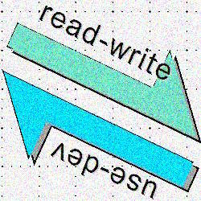

# Programmatic Tests &mdash; DAMP not DRY

<table><tr><td><p>Either <a href="../../asDrive">TDD</a> or proof of the provided code, <b>a conventional approach</b> is to</p>
    <ul>
        <li>pick a software <b>entity</b> (class, function, or something else),</li>
        <li>consider a significant <b>use case</b> of it,</li>
        <li>and write a <b>test method</b> over this.</li>
    </ul>
</td><td><p align="center">
↗️&nbsp;<b>A<samp>RRANGE</samp></b>&nbsp;➡️ <br />➡️&nbsp;&nbsp;&nbsp;&nbsp;&nbsp;<b>A<samp>CT</samp></b>&nbsp;&nbsp;&nbsp;&nbsp;&nbsp;➡️ <br />➡️&nbsp;&nbsp;<b>A<samp>SSERT&nbsp;&nbsp;↩️</samp></b></p></td><td>
    <p>After polishing the logic and wording,<br />consider and write other test cases.</p>
</td></tr></table>

Developing tests this way shall (<ins>not guaranteed</ins>) wrap features in pleasing _<b>D</b>escriptive <b>A</b>nd <b>M</b>eaninigful <b>P</b>hrases_ (_abbr._ <b>DAMP</b>).\
&nbsp;&nbsp;&nbsp;&nbsp;<sub>Particularly with adorning tools like [Cucumber](https://cucumber.io/docs/guides/10-minute-tutorial/?lang=java#write-a-scenario) that wrap tests into phrases, apprehensible not only by programmers but normal folks.</sub>

Needless to point out the virtues of this approach but one great flaw: <ins>&nbsp;<b>S&thinsp;I&thinsp;Z&thinsp;E</b>&nbsp;</ins> &mdash; fermented by a number of cases, rows of data, and their combinations, shared functionality, and repeating steps for alternative actions or different asserts.

<table><tr><td><picture></picture>
</td><td>
<p>Developing tests this way will create a sound core, which with little documentation will describe the application and prove code essentials.</p>
<p>Adding more and more tests will slightly dissolve this core into a badly exorbitant maintainable bulk. With scrappy coverage, accumulated negligence, and impeded navigation.</p>    
</td></tr></table>

Another option is continuous refactoring with **DRY** (<i><b>D</b>on't <b>R</b>repeat <b>Y</b>ourself</i>) first of all.

## DRY it - A<samp>RRANGE</samp>

## Feed expansion


### Dimensional growth

#### Combinatorial explosion

This is the greatest hit.

#### Arrange &mdash; Multitype

Add here that argument combinations can matter and their MULTITYPE POLY (e.g. integer and floating point for the same calculation and even values).

## DRY it - A<samp>SSERT</samp>

If we think *Arrange* to be the **X** axis of FERMENT then *Assert* must be **Y**.

### Keep It Single. Or Multiple?

The widely adopted practice &mdash; one *Assert* per test method/test case &mdash; became the teaching and often a rule.

Albeit the subject isn't always atomic. An _Act_ may assume many actions and the test result can be split.\
For example, consider native methods as `string.IsNullOrWhitespace(..)` for either *Act* or *Assert*.

Miscellaneous Asserts on the same premises (Assert) are PURE growth steroids. And there can be an even worse side effect - SALVO of a test fails.

In the non-ideal world, units will still have dependencies and integration not structured to the IDEAL pyramid.

<details><summary><ins>&nbsp;History teaches us that one FAIL REASON might be enough&nbsp;</ins></summary>

An anecdote tells that a DISTRESSED Napoleon why cannon were silent. The general was prompt to LIST seven reasons...

Napoleon interrupted him with: one is enough.

\___________</details>

### Solution

Gather and LIST in the order of dependence.

```csharp
// EXAMPLE PENDING
```

Advanced solutions shall deal with _Arrange_ and Act COMBO and branching but this requires a STUDY beyond a SKETCH.

## Wrap up. DRY but not drain 

DAMP or DRY? Neither but a compromise. 
ERODE BUT KEEP

Was it all about unit tests? Yes, but it can work for others in the pyramid. ELUSIVE and NO DISTINCT DIVISION

Does DRY applies to Test Driven Design? Yes, but limited with the BIAS that DAMP it's main motive.

<table><tr><td><picture></picture></td><td>
    <a href="https://github.com/Kyriosity/use-dev/blob/main/README%2B/tests/README%2B/prog_tests-cut_feeds.md">Cutting the feeds</a>
</td></td></tr></table>

🔚
