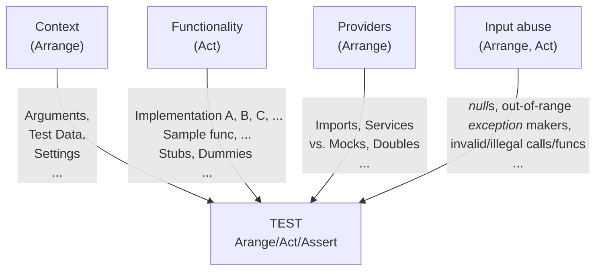

# Programmatic Tests &mdash; DAMP not DRY

Either [TDD](https://github.com/Kyriosity/read-write/tree/main/README%2B/software/tests/asDrive)⬅️ or proof of the provided code, 
**a conventional approach** is to **pick a software entity** (class, function, or something else), **consider a signigicant use case of it** and **write a test over this**:

<b>A<samp>RRANGE</samp></b> -> <b>A<samp>CT</samp></b> -> <b>A<samp>SSERT</samp></b>.

After polishing the logics and wording, consider and write other test cases. 

Developing tests this way shall (<ins>not guaranteed</ins>) wrap features in pleasant _<mark>D</mark>escriptive <mark>A</mark>nd <mark>M</mark>eaninigful <mark>P</mark>hrases_ (aka <mark><b>DAMP</b></mark>).  Particularly with adorning tools like [Cucumber](https://cucumber.io/docs/guides/10-minute-tutorial/?lang=java#write-a-scenario) that can wrap tests into phrases that not only programmers but normal folks will understand.

No need to describe the virtues of this approach but one significant flaw: <ins>&nbsp;<b>S&thinsp;I&thinsp;Z&thinsp;E</b>&nbsp;</ins>. The number of cases, rows of data and their combination, shared functionality and alternatives.

Since tests are not product and the project can be decent you may opt out any refactoring: add new tests (even with copy-paste). On the large scale it will accumulate negligence, scrappy coverage, impeded navigation, and badly exorbitant maintenance. 
But the worst drawback will be a big mass unfriendly to read / BLACK BOX NEGLECTED

This is the easiest way is to keep the CORE of descriptive tests.

<b>or&nbsp;...</b>

## DRY it

ERODE BUT KEEP

### Combinatorial explosion

This is the greatest hit, not one-dimensional combination growth but 

### MULTITYPE

### MULTI ASSERTS

## Wrap up. DRY but not drain 

DAMP or DRY? Neither but a compromise.

Was it all about unit tests? Yes, but it can work for others in the pyramid.

Does it concern Test Driven Design? Yes but with the bias that DAMP must prevail there.

🔚

