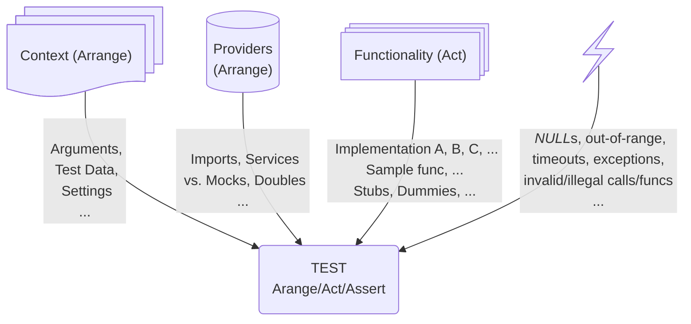

# Programmatic Tests &nbsp; &mdash; &nbsp; DAMP <samp>NOT</samp> DRY

<table><tr><td><p>Either <a href="../../asDrive">TDD<sup>e<b>V</b></sup></a> or <a href="../../asQA">proof</a> of the provided code: <b>a conventional approach</b> is to</p>
    <ul>
        <li>pick a software <b>entity</b> (class, method, feature, module, or application),</li>
        <li>consider a significant <b>use case</b> of it,</li>
        <li>and write a <b>test method</b> over this.</li>
    </ul>
</td><td><p align="center">
↗️&nbsp;<b>A<samp>RRANGE</samp></b>&nbsp;➡️ <br />➡️&nbsp; &nbsp; &nbsp;<b>A<samp>CT</samp></b>&nbsp; &nbsp; &nbsp;➡️ <br />➡️&nbsp; <b>A<samp>SSERT&nbsp; ↩️</samp></b></p>
<p><b>&larr;&nbsp;R&thinsp;E&thinsp;P&thinsp;E&thinsp;A&thinsp;T</b></p></td><td><p>After polishing the logic and wording,<br />consider and write other test cases.</p>
</td></tr></table>

Developing tests this way shall (☝🏼 no warranty) wrap features in pleasing _<b>D</b>escriptive <b>A</b>nd <b>M</b>eaninigful <b>P</b>hrases_ (_abbr._ <mark>&thinsp;<b>D&thinsp;A&thinsp;M&thinsp;P</b>&thinsp;</mark>).\
<samp>(Particularly with adorning tools like [Cucumber](https://cucumber.io/docs/guides/10-minute-tutorial/?lang=java#write-a-scenario)<sup>🔗</sup> that wrap tests into phrases, which not only programmers but also sane people can comprehend.)</samp>

Needless to point out the virtues of this approach, but one great flaw: <ins>&thinsp;<b>S&thinsp;I&thinsp;Z&thinsp;E</b>&nbsp;</ins>&thinsp;, fermented by

* the number of test cases, rows of test data (and their combinations),
* re-testing of common functionality,
* repeating steps for alternative actions or different asserts.</p>

<table><tr><td><picture></picture>
</td><td>
<p>The early layout will create a sound core, verifying code essentials and describing the application (some documentation is still required).</p>
<p>More and more tests will slightly but steadily dissolve this core into a badly maintainable bulk. With scrappy coverage, accumulated negligence, and impeded navigation.</p>
    <p>The refactoring counterblast is to <mark>&thinsp;<b>D&thinsp;R&thinsp;Y</b>&thinsp;</mark> (<i><b>D</b>on't <b>R</b>repeat <b>Y</b>ourself</i>).</p>
</td></tr></table>

<h1 align="center">DRY it &nbsp;&mdash;&nbsp; A<samp>RRANGE</samp></h1>

## Feed expansion



### Dimensional growth

* Miscellaneous sets of arguments (or test data) or even their order/combinations can make a difference.
* External settings may have alternatives.
* Different features and methods will not repeat themselves, but have the same side effects to test\
(especially for error-proof)
* Possible vital <ins>test doubles</ins> for _Asserts_ and _Acts_ are subjects of tests (sometimes the first to show up).
* Abuse of _Asserts_ and _Acts_ (as nulls or invalid values/calls) must be tested for error handling.

Each of these items alone proportionally enhances the number of test cases (with repeating substeps).

### Combinatorial explosion

**This is the greatest hit.** Any combination of two factors from the list (or picture) above _powers_ the progression. 
For honest test coverage there, no copy-paste will help (but [T4 templates](https://en.wikipedia.org/wiki/Text_Template_Transformation_Toolkit)<sup><b>w</b></sup>).

### Multitype parameters

Whether for strictly or weakly typed languages, the same argument value may appear in different types (e.g., integer and floating point for the same calculations).

#### Ideas

Many languages support generic types, which a test method may discern.

🧪[Phys/Math tests](https://github.com/Kyriosity/use-dev/tree/main/src/TuttiFrutti/FuncStore.Convers.Tests/PhysMath) in custom <code></b>C#</b> funcware</code> utilize such a technique for numeric values.

## Solutions&thinsp;/&thinsp;Workarounds

The easiest and alluring response is to write fewer tests, concentrating on guiding ones and stowing routine checks in folders where nobody will look (till an error occurs). 
Auto-generation tools may help, but their setting and tuning may be overkill.

<table><tr></tr><tr>
<td><picture></picture></td><td>
    <a href="https://github.com/Kyriosity/use-dev/blob/main/README%2B/tests/README%2B/prog_tests-cut_feeds.md"><b>Cutting<br />the feeds</b></a>
</td>
<td>

What known frameworks and less-known workarounds can do is a subject of the repository with more close-ups to practical code:
    
</td></tr></table>

<h1 align="center">D<samp>RY</samp> it &nbsp;&mdash;&nbsp; A<samp>SSERT</samp></h1>

If *Arrange* could be the **<mark>&thinsp;X&thinsp;</mark>** axis of extension, then *Assert* must be **<mark>&thinsp;Y&thinsp;</mark>**. (It looks so on the screen.)

## Keep It Single... Or Multiple?

The widely adopted practice &mdash; one *Assert* per test method/test case &mdash; became the teaching and often a written rule.

However, the subject isn't always as atomic as it may seem. An _Act_ may assume many actions, and the test result can be split.\
For example, consider native methods as `string.IsNullOrWhitespace(..)` for either *Act* or *Assert*.

Repeating arrangements for miscellaneous _Asserts_ is a growth steroid. 
And there can be even a deeper negative side effect &thinsp;&mdash;&thinsp; a small error can trigger a salvo of failing tests. 
Such a salute will hardly provide a clue but rather hide it in dependencies - inevitable even with granulated and isolated units and best-structured folders.

## 💡I<samp>DEAS</samp>💡

<details><summary><ins>&nbsp; History teaches us that one failure might be enough to know...&nbsp;</ins></summary>
    
> &nbsp;\
> As in the anecdote about **Napoleon** enraged by the silence of cannons on a flank.\
A summoned general was eager to recount seven reasons, he knew, but was shortly interrupted with\
<samp>«Already one is more than enough for me».</samp>
>
> The same Albert Einstein replied to "One Hundred Authors Against Einstein", 1931:\
> <samp>"If I were wrong, it would only take one."</samp>\
> &nbsp;

</details>

### Normalization

Grouping _Asserts_ for the same _Arrange_ is a call of reason &thinsp;&mdash;&thinsp; otherwise method opening/closing will eat half of the page.

```csharp
// EXAMPLE PENDING
```

As intuition must suggest, they can be best ordered from the most autonomous to the most dependent (not only by reference/hierarchy but, principally, logic).

Advanced versions shall deal with _Arrange_ and _Act_ blending and branching, but this asks for <s>funding</s> a good, big, pragmatic case to study and implement.

### Posers

Normalization doesn't apply well to advanced evaluation as [gradual asserts](https://github.com/Kyriosity/use-dev/blob/main/README+/tests/README+/unit_test-gradual_assert.md).

### Master cautions

When a mass of tests exceeds the sight capabilities, it's clever to select the "key" ones &mdash; which fail must be investigated first (an order and classification can be set there too).

Imagine a math engine for a project. If a floating error emerges, neither API error will matter.

<h1 align="center">Conclusion: D<samp>RY</samp> but not drain</h1>

<mark>&thinsp;<b>D&thinsp;U&thinsp;M&thinsp;P</b>&thinsp;</mark> or <mark>&thinsp;<b>D&thinsp;R&thinsp;Y</b>&thinsp;</mark>❔ Neither but a compromise. (Could I omit set phrases?) 

Was it all about unit tests? Yes, but it can work for others in the pyramid. Remember that units of tests are elusive, and there's no distinct division.

Does DRY apply to Test Driven Design? Yes, but very constrained by DAMP as its main motive.

<table align="center"><tr></tr><tr><td>👆</td><td>
    
When covering existing code, you shall find out the repetitions to group.

The opposite is for **Test Driven Development** &nbsp;&mdash;&nbsp; think in test unions prior.

</td></tr></table>

## Alternative: Short but&thinsp;<mark>/</mark>&thinsp;and descriptive

The accent of most frameworks and add-ins to them (as [fluent assertions](https://fluentassertions.com)<sup>🔗</sup>) is on the long articulated wording. 
With all readability, the handicap is that the _test subjects_ are hidden in extra clauses and parentheses.

The alternative can be a condensed, terser syntax, like these ["coagulated" expressions](https://github.com/Kyriosity/use-dev/blob/main/src/TuttiFrutti/FeatTest/README.md#assert-by-assign).

\___________\
🔚 🌙 2024-2025 ..
