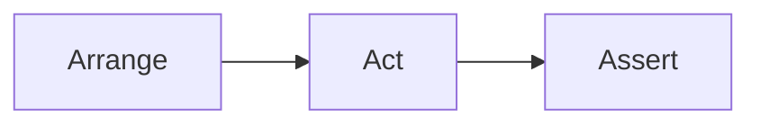

# Programmatic Tests &mdash; DAMP not DRY

**Either [TDD](https://github.com/Kyriosity/read-write/tree/main/README%2B/software/tests/asDrive)⬅️ or proof of the provided code, 
a conventional fashion is to pick a software entity (class, function, or something else) and write a particular test case over it, then consider and write other cases.**

MERMAID: Arrange -> Act -> Assert

Developing tests this way shall (not must) wrap features in nice **D**_escriptive_ <b>A</b><i>nd</i> <b>M</b><i>eaninigful</i> <b>P</b><i>hrases</i> (aka <mark><b>DAMP</b></mark>). No need to present the virtues of this approach but one big disadvantage; 
However, this approach has one significa 

See more

use-dev workaround for multi-feed

Was it all about unit tests? Yes, but it can work for others in the pyramid.

Does it concern Test Driven Design?

## DRY it

🔚

MULTI ASSERTS
