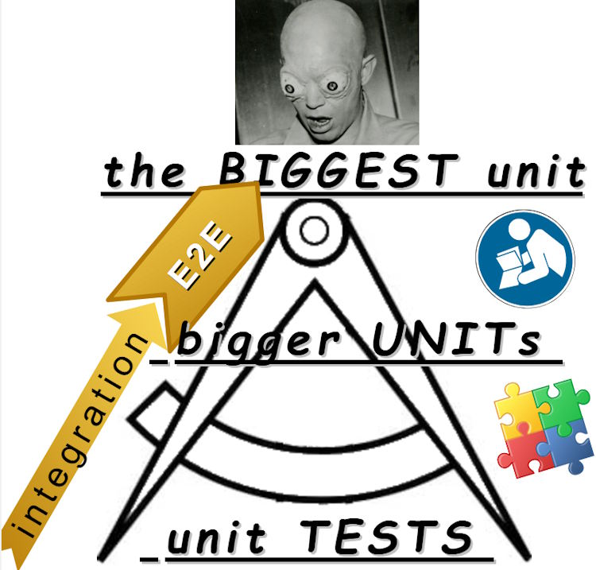

# Software &nbsp;&mdash;&nbsp; Quality Assurance &rarr; `Programmatic Tests`

<table><tr valign="top"><td><picture></picture></td><td>
  
  ### Programmatic tests are operational bricks of the QA pyramid.
  
  Though **unit tests** are at the bottom of the pyramid, any higher-level test subject is a **unit** of its own (even the whole application or service).
  
  This works in the opposite direction: there are no atomic units &thinsp;&mdash;&thinsp; any can be dissolved into lesser ones. Nevertheless, there's a bar after which irrational unit tests will overflow the project. 
  
</td></tr></table>

## Test frameworks and languages

Writing tests in the language of their subjects is natural, practical, and facilitates [TDD](../asDrive), but

- UI has no programming language (like other amorphous themes). And markup isn't one.
- Some languages (as SQL, scripts, or lower-level) aren't suited to describe tests or may be too obsolete (neglected).
- A domain may be written in a mix of languages, or similar requirements can be implemented with different tools (e.g., JavaScript with TypeScript for front-end and Java/C#/JS for backend).

Solution? Any popular language has some mainstream frameworks. Many frameworks also allow tests of UI, units/modules written in other languages, or API.🏛️

&nbsp; &nbsp; &nbsp;🏛️ <samp> E.g., even old and rare languages got test support as fastly found for reference [Cobol-check](https://github.com/openmainframeproject/cobol-check):octocat:.</samp>

## Automation

<blockquote><b>Programmatic ≠ automated.</b> But tests are the intrinsic subject of automation when applicable and beneficial.</blockquote>

// ToBe written 🚧

## Down to the practice

The more pragmatic use-dev repo discusses and renders [tests stuff](https://github.com/Kyriosity/use-dev/tree/main/README+/tests).

## Poststriptum. Big problem and challenge

With all the benefits of proof coverage and TDDeV, tests constitute a second project that requires development and maintenance. 

\___________\
🔚 ... but [README+](README+) &nbsp; ... &nbsp; collage credit: LibreOffice clipart; The Outer Limits.The&nbsp;Mutant, 1964 (imdb screenshot)
