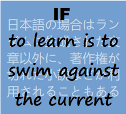

<table style="border-collapse: collapse;">
 <tr valign="top">
    <td style="border: 1px solid #0000000;">
      

    </td><td> 
     <a href="README+/software/"><b>SOFTWARE</b></a> 
      &nbsp;&nbsp;&nbsp;<a href="README+/software/README+/dev-naming.md">Naming</a>&nbsp;➰&nbsp;
      <a href="README+/software/README+/code-quality.md">Quality</a> 
      &nbsp;&nbsp;&nbsp;<a href="README+/software/README+/dev-mngmnt.md">Organization</a>&nbsp;➿&nbsp;
      <a href="README+/software/README+/dev-docu.md">Documentation</a> 
      &nbsp;&nbsp;&nbsp;&nbsp;<b>></b>&nbsp;<a href="README+/software/README+/design"><b>Design</b></a> 
      &nbsp;&nbsp;&nbsp;&nbsp;<b>></b>&nbsp;<a href="README+/software/README+/testing"><b>Testing</b></a> 
     &nbsp;&nbsp;🦋&nbsp;<a href="README+/software/README+/design/design_samples.md">Design samples</a> 
      
     <a href="README+/pencraft"><b>PENCRAFT</b></a> 
      🥱&nbsp;<a href="README+/pencraft/README+/opuses">Opuses</a>
     </td>
 </tr><tr>
  </tr><tr>
     <td>
<a href="README+/.net/"><b>C#.NET</b></a> 
      &nbsp;&nbsp;&nbsp;&nbsp;&nbsp;<a href="README+/.net/README+/a.review">Reviewed ↙️</a> 
     <a href="README+/.net/README+/b.deduced">↘️Deduced <a> 
     💠&nbsp;<a href="README+/.net/README+/wpf"><b>WPF</b></a> 
       
     ➡️&nbsp;<b><a href="https://github.com/Kyriosity/use-dev/blob/main/README+/decisions">Design decisions</a></b> 
     (<i>use-dev</i> repository)
     </td>
     <td>
      

     </td>
</table>

...
