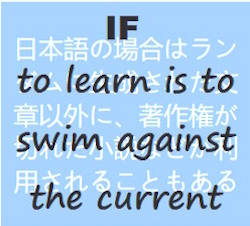
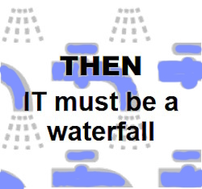

<table> 
 <tr valign="top">
    <td width="50%">
      <picture><picture>
    </td><td width="50%">
     <a href="README+/software/ArcDeco"><b>SOFTWARE</b></a> 
     &nbsp;&nbsp;<a href="README+/software/design/"><b>D&thinsp;e&thinsp;s&thinsp;i&thinsp;g&thinsp;n</b></a>&thinsp;∑&nbsp;&nbsp;<i>feat.</i>
           
     &nbsp;&nbsp;&nbsp;&nbsp;&nbsp;&nbsp;<a href="README+/software/design/names">Names</a>
     ⚙️
      <a href="README+/software/design/drive/">Drives</a>➰<a href="README+/software/design/samples">Samples</a> 
     <!-- -->
     <!--                               QA vs. TESTS          --!>
     <!-- -->
     &nbsp;&nbsp;<a href="README+/software/QA/"><b>Q&thinsp;A</b></a>&thinsp;&nbsp;⊃&thinsp;⊂&nbsp;<a href="README+/software/tests/"><b>T&thinsp;e&thinsp;s&thinsp;t&thinsp;s</b></a>
      
    &nbsp;&nbsp;&nbsp;&nbsp;&nbsp;<a href="README+/software/QA/README+/code-quality.md">Code quality</a> ➿
     <a href="README+/software/tests/asQA/README+/QA_tests-pitfalls.md">Tests pitfalls</a>
     <!-- -->
     <!--                               DOCU and ORG          --!>
     <!-- -->
     <h4>&nbsp;<a href="README+/software/docu"><b><ins>D&thinsp;o&thinsp;c&thinsp;u</ins></b></a> ➿ <a href="README+/software/mngmnt"><b>O&thinsp;r&thinsp;g&thinsp;a&thinsp;n&thinsp;i&thinsp;z&thinsp;a&thinsp;t&thinsp;i&thinsp;o&thinsp;n</b></a></h4>
    <!-- -->
     <!--                              P E N C R A F T          --!>
     <!-- -->
     <a href="README+/pencraft"><b>PENCRAFT</b></a>
               
      &nbsp;&nbsp;🥱<a href="README+/pencraft/README+/essays/README.md">essays</a> 🪝<a href="README+/pencraft/README+/memes/README.md">memes</a> 🥨<a href="README+/pencraft/README+/quotes/README.md">quotes</a>
     </td>
</tr><tr></tr><tr><td><!--                                                                                C#.NET         --!>
<a href="README+/.net/"><b>C#.NET</b></a>&nbsp;&nbsp;&nbsp;<i>feat.</i> 
&nbsp;&nbsp;&nbsp;<a href="README+/.net/README+/cs-drawbacks.md">Drawbacks</a>&nbsp;✖️&nbsp;
<a href="README+/.net/README+/cs-lacks.md">Lacks</a>&nbsp;➗&nbsp;
  
&nbsp;&nbsp;&nbsp;<a href="README+/.net/README+/cs-malpractice.md">Malpractices</a>&nbsp;➕&nbsp;<a href="README+/.net/README+/cs-feat_underused.md">Underused</a>
  
 &nbsp;&nbsp;<b>♯</b>&nbsp;<b>Sides/Parts</b>
    
&nbsp;&nbsp;&nbsp;&nbsp;<a href="README+/.net/README+/parts/cs-lacks-parts.md">Nice to have</a>&nbsp;➖&nbsp;<a href="README+/.net/README+/parts/cs-feat_shadow.md">In shadow</a> 
      <!-- -->
     <!--                               WPF          --!>
     <!-- -->
  &nbsp;&nbsp;🪟&nbsp;<a href="README+/.net/README+/wpf"><b>W&thinsp;P&thinsp;F</b></a>
   <kbd>Closer to code</kbd> 
  &nbsp;&nbsp;&nbsp;<a href="README+/.net/README+/cs-hints.md">Hints</a>&nbsp;➡️&nbsp;
 <a href="https://github.com/Kyriosity/use-dev/tree/main/README%2B/patterns">Patterns</a>
  
 &nbsp;&nbsp;&nbsp;<a href="https://github.com/Kyriosity/use-dev/tree/main/README%2B/frames">Frames</a>&nbsp;↗️&nbsp;
     <a href="https://github.com/Kyriosity/use-dev/blob/main/README+/decisions">Decisions</a>
</td><td>
      <picture><picture>
     </td>
</table>
