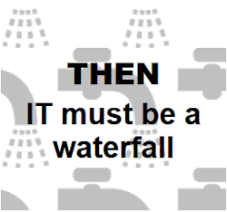

<table>
 <tr valign="top">
    <td width="50%">
      <picture><picture>
    </td><td width="50%">
     <a href="README+/software/ArcDeco"><b>SOFTWARE</b></a> 
     &nbsp;&nbsp;<a href="README+/software/design/names">Names</a>
     ⚙️
      <a href="README+/software/design/drive/">Drives</a>
     ➰
     <a href="README+/software/design/samples">Samples</a> 
     
<a href="README+/software/design/"><b><i>design</i></b></a>&thinsp;➕↘️

      &nbsp;&nbsp;<a href="README+/software/QA/README+/code-quality.md">Code quality</a> 
    ➿
     <a href="README+/software/QA/README+/tests-pitfalls.md">Tests pitfalls</a>
      
<a href="README+/software/QA/"><b><i>all QA notes</i></b></a>&thinsp;↘️

     
&nbsp;&nbsp;
     <a href="README+/software/docu">Documentation</a>
     ➿
     <a href="README+/software/mngmnt">Organization</a>
     

     <a href="README+/pencraft"><b>PENCRAFT</b></a> 
      🥱<a href="README+/pencraft/README+/essays/README.md">essays</a> 🪝<a href="README+/pencraft/README+/memes">memes</a> 🥨<a href="README+/pencraft/README+/quotes/README.md">quotes</a>
     </td>
</tr><tr></tr><tr><td>
<a href="README+/.net/"><b>C#.NET</b></a> 
&nbsp;&nbsp;&nbsp;<a href="README+/.net/README+/cs-drawbacks.md">Drawbacks</a>&nbsp;✖️&nbsp;
<a href="README+/.net/README+/cs-lacks.md">Lacks</a>&nbsp;➗&nbsp;
  <a href="README+/.net/README+/cs-hints.md"><mark>Hints</mark></a>
  
&nbsp;&nbsp;&nbsp;<a href="README+/.net/README+/cs-malpractice.md">Malpractices</a>&nbsp;➕&nbsp;<a href="README+/.net/README+/cs-feat_underused.md">Underused</a>
  
 &nbsp;&nbsp;<b>♯</b>&nbsp;<b>Sides/Parts</b>
    
&nbsp;&nbsp;&nbsp;&nbsp;<a href="README+/.net/README+/parts/cs-lacks-parts.md">Nice to have</a>&nbsp;➖&nbsp;<a href="README+/.net/README+/parts/cs-feat_shadow.md">In shadow</a> 
  &nbsp;&nbsp;🪟&nbsp;<a href="README+/.net/README+/wpf"><b>WPF</b></a> 
       
     <b><a href="https://github.com/Kyriosity/use-dev/blob/main/README+/decisions">DESIGN DECISIONS</a></b>&nbsp;➡️<code>use-dev</code>
</td><td>
      <picture><picture>
     </td>
</table>
