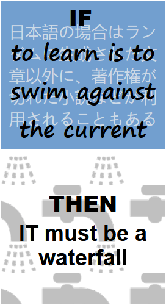

<table style="border-collapse: collapse;">
 <tr valign="top">
    <td style="border: 1px solid #0000000;">
      

    <td>
      <a href="readme+/software/"><b>SOFTWARE</b></a> 
     |- <a href="readme+/software/README+/code-quality.md">Code quality</a> 
      |- Design 
      |- Testing 
      <h4><a href="readme+/.net/">C#.NET</a></h4>
     |- Hints 
       
      <a href="readme+/pencraft"><b>PENCRAFT</b></a> 
      |- <a href="readme+/pencraft/readme+/opuses">Opuses</a> 
       &nbsp;&nbsp;&nbsp;&nbsp;&nbsp;&nbsp;&nbsp;&nbsp;&nbsp;&nbsp;&nbsp;&nbsp;&nbsp;&nbsp;&nbsp;&nbsp;&nbsp;&nbsp;&nbsp;&nbsp;&nbsp;&nbsp;&nbsp;&nbsp;&nbsp;&nbsp;&nbsp;&nbsp;&nbsp;&nbsp;&nbsp;&nbsp;
    </td>
 </tr>
</table>

- [__Software__](readme+/dev/)\
|- [Design](readme+/dev/design/)\
|- [Partitioning](readme+/dev/design/readme+/software-parts)\
|- [Around the code](readme+/dev/code/)\
|- [Testing](readme+/dev/testing/)

- [__C#.net__](readme+/.net)\
|- [Reviewed](readme+/.net/readme+/audit) :arrow_lower_left:\
|- :arrow_lower_right: [Deduced](readme+/.net/readme+/deduced)\
|- **Foundations**\
|--- [WPF](readme+/.net/wpf/)

|- ➡️ [**Design decisions**](https://github.com/Kyriosity/use-dev/blob/main/readme+/decisions) (_use-dev_)

