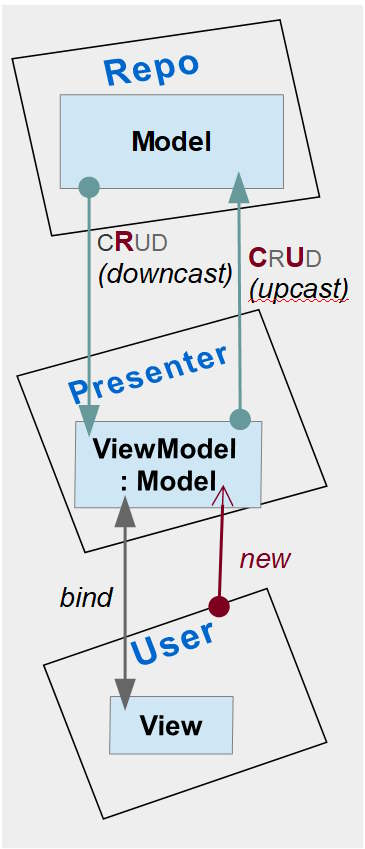

# Momvvmwvmodel-cohesionsion

## Classical aggregation
https://docs.microsoft.com/en-us/archive/msdn-magazine/2009/february/patterns-wpf-apps-with-the-model-view-viewmodel-design-pattern

## Inheritance alternative

### What about ViewModelBase

## Which to use
