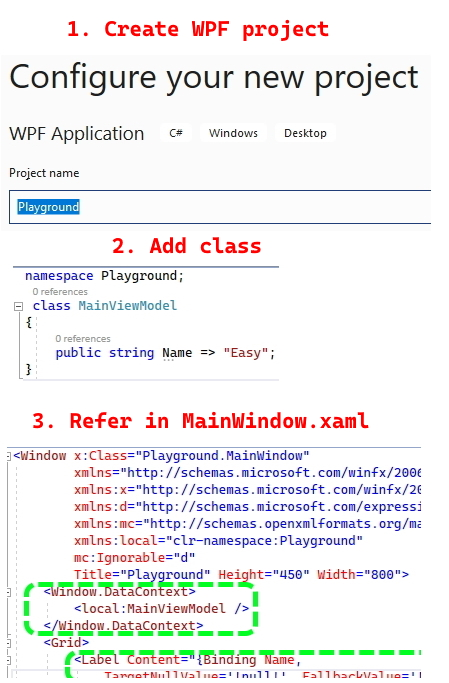

# MVVM and WPF
Model-View-ViewModel (abbr. MVVM) is a well accepted, easy, powerful concept of __separation of concerns__, also known as [MVP](https://martinfowler.com/eaaDev/uiArchs.html).

WinForms application can be an exemplary MVVM:wrench: but it was WPF that formed a symbiosis with MVVM and made the latter mainstream (and not only in WPF).\
Notably successful and stable Microsoft Visual Studio&nbsp;2010 was written from scratch in WPF relying on MVVM (Model-View-ViewModel).

## ViewModel
ViewModel is the heart of the pattern and was wittily titled [converter on steroids](https://joshsmithonwpf.wordpress.com/2008/12/01/the-philosophies-of-mvvm/).

ViewModel shall be fully unaware of presentation details - any UX declarations here (colors, sizes, layout, sounds/volume i.a.) are definitely wrong.\
It ought to be *info*, *alarm*, *warning*, *timeout*, *off-line*, *trusted*. And the View shall care about turning them into proper UX elements.

As well ViewModel shall not outline ways of UI arrangement and interaction (windows, panes, overlays, prompts).:raising_hand:

&nbsp;&nbsp;&nbsp;&nbsp;:raising_hand:&nbsp;Could be redundant to say but still a common mistake.
### Notification grouping

## Model

## View

## Messaging within MVVM
### Commands
### Dialogs

## Use of frameworks

---
## Wrapping Up
MVVM has been widely established, but is neither golden nor universal section. On call of specificity or creativity any other, even monolithic, form is legal.&nbsp;:triangular_ruler:

&nbsp;&nbsp;&nbsp;&nbsp;:triangular_ruler:&nbsp;Google team coined *Model-View-Whatever* for its Angular

An MVVM application may grow into an enterpise solution, but from the ground up its sketch requires few minutes:

:arrow_down: Project of Microsoft Visual Studio
