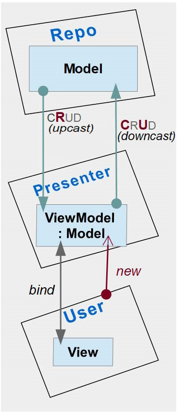

# MVVM - Model & ViewModel cohesion

## Classic aggregation

As [Microsoft guidelines](https://docs.microsoft.com/en-us/archive/msdn-magazine/2009/february/patterns-wpf-apps-with-the-model-view-viewmodel-design-pattern) suggest ViewModels will usually aggregate Models in such a way:

<details>
  <summary><ins>&nbsp;Ordinary aggregation - sketch</ins></summary>
  
  ```csharp
  namespace Models;
  class Book
  {
      string Title { get; set; }
      // ...
  }
  ```
  ```csharp
  namespace ViewModels;
  class sdf
  {
     private Models.Book _model = // ... anyhow supplied or injected
     string Title {
        get => _model.Title;
        set { _model.Title = value; OnPropertyChanged(); }
     }
  }
  ```
</details>

There's nothing foul in this practice but an itchy feeling of copy-paste and overcoding.

## Inheritance alternative



### What about ViewModelBase

## Which to use
