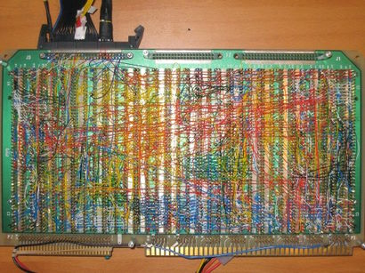
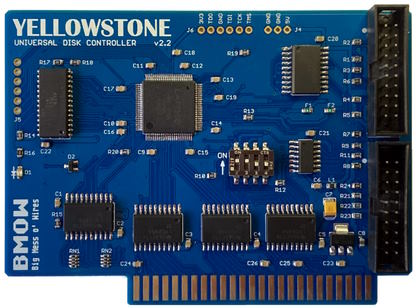

# WPF - Orchestration of notifications

WPF built-in [DataContext](https://learn.microsoft.com/dotnet/desktop/wpf/data/how-to-specify-the-binding-source) has only to raise `PropertyChanged`<sup>:raising_hand:</sup> with the name of item, which value bound elements must re-evaluate.\
&nbsp;&nbsp;&nbsp;&nbsp;<sup>:raising_hand:</sup>&nbsp;<sub>'Changed' decieves, since it's most but not the only cause of the event.</sub>

You must already know and use fast and easy [Microsoft recipe](https://learn.microsoft.com/en-us/dotnet/desktop/wpf/data/how-to-implement-property-change-notification): `set {field = value; OnPropertyChanged();}`. It's enough for flat easy forms but on the path of the true developer there're:
+ tied and calculated values,
+ groups and hierarchies of cross-dependent ViewModels, 
+ need for reuse of notification logics,
+ diverse notifications mechanism (not only PropertyChanged)

And then if a ViewModel were printed on a board it would look:\
\
(*Found on bigmessowires.com*)

## Proposal 

Another snapshot from the same site must give the cue.\


"Chips" shall encapsulate notification logics with some calls. It's the matter of taste how they will be implemented, for example either injection or inheritence from:

```csharp
interface IOrchestrating {
   void Notify([CallerMemberName]string caller="<n/a>");
   void MassNotify();
}
```

Beyond the order such approach will bring next possibilities:
+ optimization (e.g. black out notifications for hidden UI parts)
+ easy swap of notification model
+ hooks for tracing, logging etc.

## Commands and messages

Organisation of [WPF commands](https://learn.microsoft.com/en-us/dotnet/desktop/wpf/advanced/commanding-overview) may follow the same model, but they are easier and it's enough to pack commands in corresponding sub-ViewModels, while `CanExecute` properties may be orchestrated.

MVVM messaging, either custom or out-of-the box, is based on properties.

## Irrelevant tasks

There're other tools to improve notification but they aren't orchestration:

+ Everithing that [ReactiveX](https://reactivex.io/) can do.
+ Any wiring on the View side.

