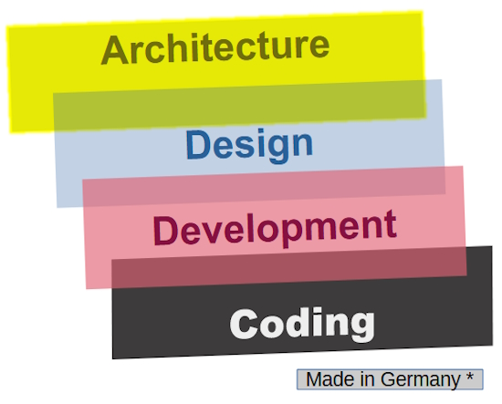

... 🚧 DRAFT 🚧 ...

# The creation of software

What makes software? In a word - **_development_**. In four - 

\
:de: The colors were inspired by the alternative theory of the German flag (_Schwarz-Rot-Gold_): from the black past through the bloody present to the golden future. I only inserted some tearful blue for lachrymose dev.

**_Coding_**, **_development_**, **_design_**, and **_architecture_** make up a blend of overlapping and time-unordered processes.&nbsp;:stop_button:

&nbsp;&nbsp;&nbsp;&nbsp;:stop_button: Some words more? With all respect to DevOps, testing, management, and administration they only facilitate the development and deployment of software.

## Overlapping and communication

<ins>&nbsp;<b>Processes as layers</b>&nbsp;</ins>

Let's see them intermixed

### Persons, roles, or tasks? 

### Is there an architect as in Matrix?

