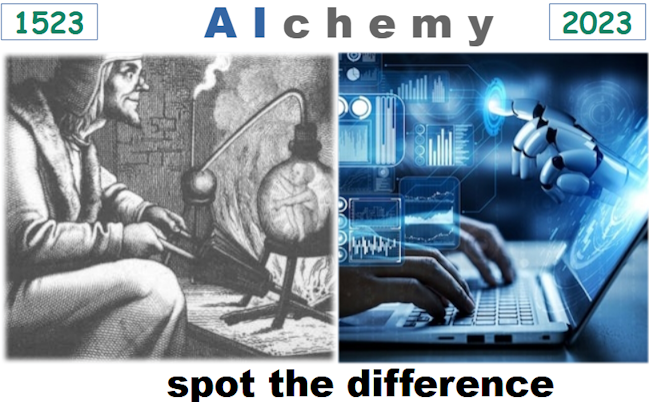

# Artificially intelligent 2023 - Much ado about ... fussing?

In the hottest on record 2023 _Artificial Intelligence_ is on trend again. Nobody will dodge this "IntelliSteamPunk" festival - __AI__ and __GPT__ are in every other lecture, article, or product release.

Torrents of news and announcements have urged prominent software engineers, scientists, and their leads to [think of a dam](https://futureoflife.org/open-letter/pause-giant-ai-experiments/) against [AI dystopia](https://www.businessinsider.com/ai-extinction-risk-openai-deepmind-anthropic-ceos-sam-altman-2023-5), while other visions are:

<ins>&nbsp;Inspiring mainstream&nbsp;</ins>

&nbsp;
 
* *Sundar Pichai*, Google CEO:\
"AI is the most profound technology humanity is working on today."
* *Jensen Huang*, CEO of NVIDIA:\
"Software is eating the world, but AI is going to eat software."
* MkCinsey & Company:\
"Generative AI’s impact on productivity could add trillions of dollars [annually]..."
* *Ray Kurzweil*, inventor and futurist:\
"By 2029, computers will have emotional intelligence and be convincing as people."
* _Gray Scott_, futurist, techno-philosopher, founder and CEO of SeriousWonder:\
  "There is no reason and no way that a human mind can keep up with an artificial intelligence machine by 2035."
* [and how without him] *Elon Musk*, xAI startup founder:\
"The goal of xAI is to understand the true nature of the universe." [no more or no less]

\__________________________________________

<ins>&nbsp;Occasional pragmatism&nbsp;</ins>

* *Ginni Rometty*, former CEO of IBM:\
"Some people call this artificial intelligence, but the reality is this technology will enhance us. So instead of artificial intelligence, I think we'll augment our intelligence."

* *Larry Page*, 2000: "Artificial intelligence would be the ultimate version of Google. ... Unfortunately, we’re nowhere near doing that now."

* _Christopher Nolan_, filmmaker, questioned about AI in a 2023 interview:\
"... the real world is, by definition, infinitely complex. ... And so, any digital simulation or technology that simulates, eventually, it always hits a particular limitation."

* _Michael Atleson_, Attorney, Federal Trade Commission, 27/Feb/2023: "Keep your AI claims in check."

* _Sam Altman,_ [on/off] CEO of OpenAI, 04.Dec.2022: "i am a stochastic parrot, and so r u."&nbsp;🦜\
vs. _Arikia Millikan_: [Parrots are not stochastic and neither are you](https://www.content-technologist.com/stochastic-parrots/).

&nbsp;&nbsp;&nbsp;&nbsp;&nbsp;&nbsp;&nbsp;&nbsp;🦜 The term Emily M. Bender _et al_ coined with "On the Dangers of Stochastic Parrots: Can Language Models Be Too Big?".

\__________________________________________

<ins>&nbsp;Philistine margins (as of mine)&nbsp;</ins>

&nbsp;

*&nbsp;Images are for illustrative purposes only and were taken from Wiki Commons and IMLO (learncomputerscienceonline.com)

\__________________________________________

## Stumbling block

Neither philosophy nor exact sciences nor neurobiology can formulate _intelligence_. Its genesis, individual rise, and (un)consciousness behind are a bigger mystery. 
Digitalization speaks in precise definitions - and there are none.&nbsp;⚙️

Adepts of both bright and dismal AI future readily assume its *self-knowledge/awareness* as a trivial matter of time. 
To brew by itself in increasingly complex code bouillon or get all of a sudden [short circuited](https://www.imdb.com/title/tt0091949)&nbsp;🎦.

IT fantastically and reliably automates much of hard cogitative ops:coffee:, but not vague abstraction, (self-)criticism, motivation - which are preconditions of great enlightenings in exact sciences&nbsp;:art:.

&nbsp;&nbsp;&nbsp;&nbsp;⚙️ Publicized views of decision-making as a relay work of neurons preset by acquired knowledge is an ingenuous simplism of free will debate.\
&nbsp;&nbsp;&nbsp;&nbsp;:coffee: Where humans are slow, prone to errors, lack parallelism, and finally get distracted, fatigued, or frustrated.\
&nbsp;&nbsp;&nbsp;&nbsp;:art: The same in non-exact studies and art isn't that evident and requires a separate survey.

## Evidence

You can still think up a **:canada:**:parking::razor::switzerland::a:, which a diligent fellow will unweave but Internet-connected AI-bot may only exhaust (unless you limit attempts).

The progress of computing powers allowed _assisted mathematical proofs_, impossible before. Artificial neural net of all the processors in the world wouldn't solve an open _mathematical problem_&nbsp;:1234:. Humans do.&nbsp;:scientist:

It was a unique **IBM** supercomputer (Deep Blue) that finally beat the world chess champion (Gary Kasparov) in 1997 - now it could be a freeware app in hand-held trash. However, developers wrote C/C++ for their engines (up to _Stockfist_ and _Leela Chess Zero_), while AI can't generate a better one. 

IDEs and assists strongly boost dev productivity, but if any AI claims to write the code, it will be either a snippet or most rated Q&A or you need to describe the requirements closely to operators.

Driving is a vivid subject of automation, which existing auto-pilots realized practically to the whole extent. No _deus ex machina_ happened to handle the small remaining % of traffic hazards. Auto-pilot "level 5" is still "next year" (Elon Musk, since 2014), while authorities suspend robo-taxis because of accidents.

 _Supervised machine learning_, that nurtured the [Mechanical Turk](https://en.wikipedia.org/wiki/Mechanical_Turk), now shades significant human assistance and intervention behind many AI processes (individually by developers and by thousands in low-rate support).

&nbsp;&nbsp;&nbsp;&nbsp;&nbsp;&nbsp;&nbsp;&nbsp;:1234: Conditions for many are plain and unambivalent enough to submit them as a clause to a chatbot.\
&nbsp;&nbsp;&nbsp;&nbsp;&nbsp;&nbsp;&nbsp;&nbsp;:scientist: As _Grigori Perelman_ with one of the seven _Millenium Problems_ (announced in 2010).

## Conclusion

Math, physics, and linguistics theses with R&D ("neural" networks, quantum mechanics, stochastic models), and rising computing powers aren't magic but the synergism of natural intelligence. **AI** overhypes their potential and credits groundbreaking products:hammer_and_wrench: with self-learning. 

Compare to hash functions on pure math, which had silently revolutionalized IT before the blockchain boom.

&nbsp;&nbsp;&nbsp;&nbsp;:hammer_and_wrench: Processing global amounts of data in real-time, and finding patterns there; image/video on-the-fly recognition and filtering; routine translation and text generation; searching for better decision.

## Appendix 1/1. Preceding AI tides

Grunting "again":top: obliges me to reminisce other AI booms, impromptu and without the wiki. I skip old fiction (Timber Intelligence of Pinocchio and  a bit more scientific), the times when man humanized mechanical or electrical breakthroughs, and would resume on the digital era.

### 1950s - The crucial IT decade ever

Energized racks of metals, glass, and vacuum replaced hives of [handmade calculations](https://commons.wikimedia.org/wiki/File:Human_computers_-_Dryden.jpg#/media/File:Human_computers_-_Dryden.jpg).💡 Innovative mathematicians devised the realm and craft of **software** from the ground up and right before one's eyes. 

The leap in hardware and programming could surpass the wildest sci-fi, and two letters could suggest that processors will soon be peers of human brains.

<ins>&nbsp;These two letters were not 'AI' but ...&nbsp;</ins>

  
&nbsp;&nbsp;&nbsp;&nbsp;&nbsp;&nbsp;&nbsp;&nbsp;... **IF**.

> High-level languages, FORTRAN or COBOL, described algorithms close to usual English, and the **IF** statement introduced the feeling of human doubt and decision-making.

\__________________________________________ 

&nbsp;&nbsp;&nbsp;&nbsp;💡 To be pedant: digital computers emerged in 1940s and already in 1950s began changing vacuum tubes to transistors.

### Late 1970s

Computers got thinner and gradually spread from science calculations to business (with a much greater audience, spectrum of tasks, and a bit of private time for amusement). Operating Systems grew into a separate phenomenon. 

Robotics delivered funny androids. Programs could support a kind of console dialog for consulting or entertainment (some definitely saw sparks of sentience on both sides there).

In chess, with its intellectual aura, programs could give winning hints (not for cheat as nowadays but an experiment) that grandmasters couldn't discern and attributed to the abrupt progress of their inferior opponents.&nbsp;:game_die:

&nbsp;&nbsp;&nbsp;&nbsp;:game_die: It's AlphaGo in 2023 for another strategy game.

### Late 1980s - early 1990s

PCs had become a folk factor at work and home. Thousands of enthusiasts, fascinated by the might and ease of programming, along with top engineers, which one could hire then for symbolic rates, tried to reanimate AI.

A side-effect of that kick was amateur pseudo-sciences like _the theory of inventive problem-solving_.
___

And here we are in **2023**, when _there will be no (human) programmers in five years&nbsp;_:one:. No fear, thanks to AI _you'll have universal high income_&nbsp;:two:, and _AI can now make you immortal_&nbsp;:three:.

&nbsp;&nbsp;&nbsp;&nbsp;&nbsp;&nbsp;:one: *Emad Mostaque*, CEO of Stability AI, 2023\
&nbsp;&nbsp;&nbsp;&nbsp;&nbsp;&nbsp;:two: _Elon Musk_ [again], Nov 3, 2023\
&nbsp;&nbsp;&nbsp;&nbsp;&nbsp;&nbsp;:three: _Bernard Marr_, Forbes, Feb 21, 2023 

&nbsp;&nbsp;&nbsp;&nbsp;&nbsp;&nbsp;&nbsp;&nbsp;&nbsp;&nbsp;&nbsp;&nbsp;... ⌛ LET's RECAP in 5 YEARs :microscope: ...
