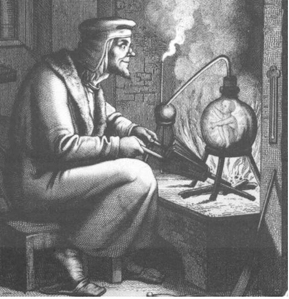

# Arteficial Intelligence - Much ado about ... marketing?

Artificial Intelligence is a hot theme in 2023, again😾. 
You can't dodge - in my city "AI" and "ChatGPT" saturate the program of the summer digital festival (every other lecture names them).

Its pace must be that giant that some scientists, prominent software engineers, and tech leads [search for a break pedal](https://futureoflife.org/open-letter/pause-giant-ai-experiments/). Besides scaring and common other actual visions divide into:

<ins>&nbsp;Impressive and inspiring&nbsp;</ins>

&nbsp;

* *Sundar Pichai*, Google CEO:\
"AI is the most profound technology humanity is working on today."
* *Jensen Huang*, CEO of NVIDIA:\
"Software is eating the world, but AI is going to eat software."
* MkCinsey & Company:\
"Generative AI’s impact on productivity could add trillions of dollars [annually]..."
* *Ray Kurzweil*, inventor and futurist:\
"By 2029, computers will have emotional intelligence and be convincing as people."
* [and how without him] *Elon Musk*, xAI startup founder:\
"The goal of xAI is to understand the true nature of the universe."

\__________________________________________

<ins>&nbsp;Realistic and pragmatic&nbsp;</ins>

&nbsp;

Rare find, not on the first page of the search output but ...

* *Ginni Rometty*, CEO of IBM\
"Some people call this artificial intelligence, but the reality is this technology will enhance us. So instead of artificial intelligence, I think we'll augment our intelligence."\
✋&nbsp;Note the keyword *augment*, which can apply to the abacus, paper thesaurus, or supercomputers in the same context.

* _Christopher Nolan_, filmmaker, questioned about AI in a 2023 interview:\
"... the real world is, by definition, infinitely complex. ... And so, any digital simulation or technology that simulates, eventually, it always hits a particular limitation."

* _Michael Atleson_, Attorney, Federal Trade Commission, 27/Feb/2023:\
"Keep your AI claims in check."

\__________________________________________

<ins>&nbsp;Philistine and unimaginative (as of mine)&nbsp;</ins>

&nbsp;

* **AI Lab, ~1500s** (yes, AI)

* **Homunculus Development, 2020s**

.jpg)

*&nbsp;Images are for illustrative purposes only and belong to the wiki and IMLO

\__________________________________________

## Intelligence

Neither philosophy nor exact sciences formulate _intelligence_, and its genesis is a greater mystery. 
What methodology or algorithm could reproduce undefined?

Visioners of both the bright and dismal future of AI readily assume its *self-awareness* as a trivial matter of time. To either brew in more and more complex code or get [short circuited](https://www.imdb.com/title/tt0091949)&nbsp;:cinema:.

Digital effectively automates much of cogitative ops, but not unformalizable that makes great mathematicians and physicians: abstraction, criticism, motivation.

Would this be enough to look at *AI* as a buzzword rather than technology? Or IntelliSteampunk vs. AI dystopia.

## Materiality

<ins>&nbsp;<b>Automated but improperly credited to AI:</b>&nbsp;</ins>

&nbsp;
  
+ processing vast amounts of data in real-time, finding patterns there,
+ translation,
+ text/image/video generation,
+ recognition of all kinds with on-the-fly processing (video),
+ assisted mathematical proofs (impossible without computers),
+ tutoring (as coding assistance)
+ engines that can smash humans in intellectual sports (Stockfish in chess)

\__________________________________________ 

<ins>&nbsp;<b>Expected from AI but unavailable</b>&nbsp;</ins>

&nbsp;

- **First and foremost**, pass so-called _Turing_ test\
You can think up a _CAPTCHA_, which a motivated fellow will promptly pass but AI may only exhaust.
- Select and prove any unsolved mathematical problem with all computing power in the world\
(Humans can do, as _Grigori Perelman_ with one of the seven _Millenium Problems_.)
- Write the strongest chess engine

\__________________________________________ 

<ins>&nbsp;<b>Hype and hoax</b>&nbsp;</ins>

&nbsp;

- **First and foremost** AI is publicity for investors. That has nothing to do with progress and technology.
- There's human assistance behind many AI tricks (either individual tuning or "machine learning" by thousands in low-rate offshore).\
  (Do you remember machine learning of [Mechanical Turk](https://en.wikipedia.org/wiki/Mechanical_Turk)?)

\__________________________________________ 

## Appendix. History of AI hype

Grunting "again"😾 obliges me to recall AI Tides, impromptu and without wiki. I'd skip old fiction and the times when man humanized mechanical breakthroughs, and resume on the digital era.

The **1950s** were crucial for IT - a rack of metals, glass, and vacuum could replace hives of handmade calculations, and scientists elaborated HMIs with high-level languages. 

The leap in both hardware and software could surpass sci-fi fantasies. And there were two letters (not AI) that made folks think that processors will soon be peers of human minds.

<ins>&nbsp;These two letters, if you are intrigued, were ...&nbsp;</ins>

&nbsp;&nbsp;&nbsp;&nbsp;&nbsp;&nbsp;**IF** -- This statement in high-level languages introduced the feeling of human doubt and decision-making.

\__________________________________________ 

In the **1970s** computers gradually spread from science calculations to business assistance, and robotics rendered funny androids. In the game of chess, with its intellectual aura, computers could give winning hints that grandmasters couldn't discern and had attributed to their opponents.

In the late **1980s** - early **1990s** PCs became a mass factor at work and home. Thousands of enthusiasts and top-level, which one could hire for symbolic rates, tried to reanimate AI, giving a start impulse pseudo-sciences like _the theory of inventive problem-solving_.

And here we are in **2023**, when "there will be no (human) programmers in five years" (*Emad Mostaque*, CEO of Stability AI).

