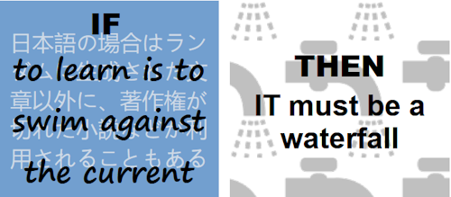
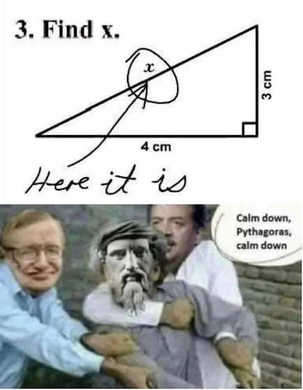

# IT memes - personal selection

I'll share IT memes that I remember and like.

<ins>&nbsp;<b>First and foremost: to learn is to swim against the current ...</b>&nbsp;</ins>

&nbsp;
  

The grains of truth in this wisdom:

* No other knowledge erodes so quickly as the IT tech stack - languages/scripts, markup, frameworks, and their IDEs, UX styles (sub)emerge, and mutate annually.:violin:
* In the horizontal dimension a developer can't stick to a favorite language and must be competent in a wide techno spectrum.

_Mobilis in Mobili_

&nbsp;&nbsp;&nbsp;&nbsp;&nbsp;&nbsp;:violin: Javascript/HTML, which one learned in 2000, remains only as basic syntax. It went through numerous libs, polyfills, jQuery, and other cool tools and at the moment transformed into single-page frameworks, which rule web dev.

**Solution?**

> Don't swim against the current. Stay in the river, become the river; and the river is already going to the sea. This is the great teaching.\
— Rajneesh, aka Osho (1931-1990

Translated east-to-west this means: find a sinecure in a big corporation.

---------

<ins>&nbsp;<b>Fair random</b>&nbsp;</ins>

&nbsp;

  

---------

<ins>&nbsp;<b>Marsupial covariance</b>&nbsp;</ins>

&nbsp;

 

https://www.snopes.com/fact-check/shoot-me-kangaroo-down-sport/

---------

<ins>&nbsp;<b>Programmer in a math class</b>&nbsp;</ins>

&nbsp;

 

Well, ability in exact sciences isn't a prerequisite for programming today. You shan't develop a sorting algorithm since you may find one.

---------

... 📝 TO BE CONTINUED 📝 ...
